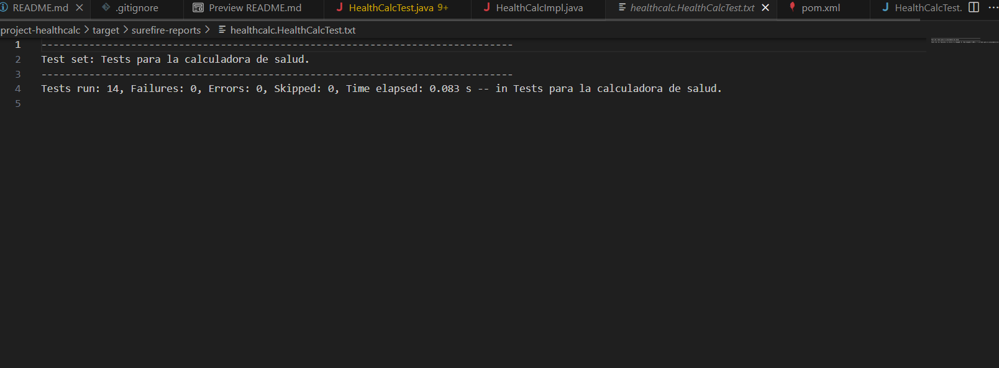
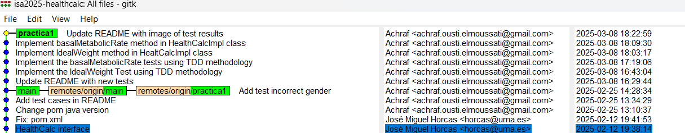
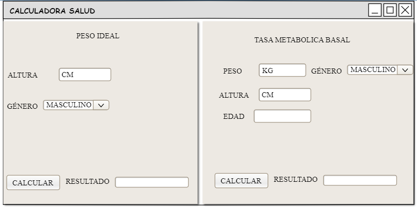
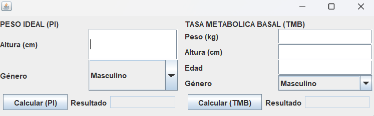

# isa2025-healthcalc
Health calculator used in Ingeniería del Software Avanzada
# Practica 1

## Casos de prueba 

A continuación se enumerará una serie de prueba que se tendrá en cuenta , a la hora de realizar el proyecto.

### Ideal Weight
 -Test en la situación de introducir un género diferente a "m" o "w"

 -Test en la situación de introducir una altura en negativo

 -Test calcular correctamente el idealWeight para hombres

 -Test calcular correctamente el idealWeight para mujeres

 -Test en la situacion de introducir una altura igual a 0

### Basal Metabolic Rate
-Test en la situación de introducir un peso negativo

-Test en la situación de introducir una edad negativo

-Test en la situación de introducir una edad igual a 0

-Test en la situación de introducir un genero diferente a "m" o "w"

-Test en la situación de introducir un peso igual a 0

-Test en la situación de introducir una altura igual a 0

-Test en la situación de introducir una altura negativo

-Test calcular correctamente el Basal Metabolic Rate para hombres

-Test calcular correctamente el Basal Metabolic Rate para mujeres

# Resultados Al ejecutar los test

# Commits Realizados durante la Practica 1

# Practica 4

## Prototipo Calculadora

## Interfaz Calculadora

# Practica 7

## Refactoring 1: Cambiar tipo de gender de char a Gender
1. Bad smell: Primitive Obsession
2. Refactoring aplicado: Reemplazo de primitivas por enumeration 
3. Tipo: Attribute refactoring
4. Descripción: He creado un enum Gender para representar el género en vez de usar un char, y he actualizado todos los métodos y clases que usaban el char para que ahora utilicen Gender.
5. Cambios manuales: 1 enum creado, 2 métodos adaptados

## Refactoring 2: Sustituir el uso de primitivas por objetos (Person)
1. Bad smell: Primitive Obsession
2. Refactoring aplicado: Introduce Parameter Object
3. Tipo: Method refactoring
4. Descripción: Se remplazó el uso de multiples parámetros (weight,height,age,gender) en los métodos por una interfaz Person.
5. Cambios manuales: 1 interfaz nueva, 1 nueva clase (Persona) que implementa la interfaz.

## Refactoring 3 Extraccion de responsabilidades de la clase HealthCalc:

1. Bad smell: God Class (Clase Dios) en HealthCalcImpl, ya que centraliza demasiadas responsabilidades.
2. Refactoring aplicado: Extract Class (Extracción de clase) para dividir la lógica en CardiovascularMetrics y MetabolicMetrics.
3. Tipo: Class refactoring.
4. Descripción: Separé las funcionalidades de cálculo de peso ideal y tasa metabólica basal en dos clases independientes siguiendo el diagrama propuesto, delegando las responsabilidades específicas a cada una.
5. Cambios manuales: 2 clases nuevas creadas, 1 método en cada clase