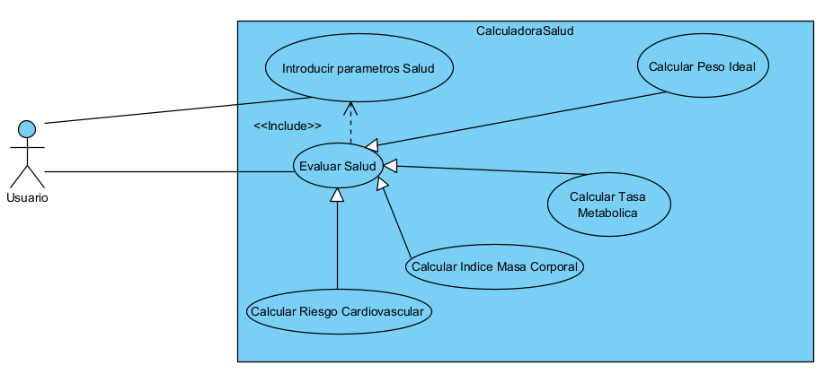

# isa2025-healthcalc
Health calculator used in Ingeniería del Software Avanzada

# Practica 1

## Casos de prueba 

A continuación se enumerará una serie de prueba que se tendrá en cuenta , a la hora de realizar el proyecto.

### Ideal Weight
 -Test en la situación de introducir un género diferente a "m" o "w"

 -Test en la situación de introducir una altura en negativo

 -Test calcular correctamente el idealWeight para hombres

 -Test calcular correctamente el idealWeight para mujeres

 -Test en la situacion de introducir una altura igual a 0

### Basal Metabolic Rate
-Test en la situación de introducir un peso negativo

-Test en la situación de introducir una edad negativo

-Test en la situación de introducir una edad igual a 0

-Test en la situación de introducir un genero diferente a "m" o "w"

-Test en la situación de introducir un peso igual a 0

-Test en la situación de introducir una altura igual a 0

-Test en la situación de introducir una altura negativo

-Test calcular correctamente el Basal Metabolic Rate para hombres

-Test calcular correctamente el Basal Metabolic Rate para mujeres

## Resultados Al ejecutar los test

## Commits Realizados durante la Practica 1

# Practica 2

## Imagen Diagrama Caso Uso Calculadora Salud
<<<<<<< HEAD

## Especificacion Caso Uso Peso Ideal
CALCULAR PESO IDEAL (FULLY DRESSED VERSION)

Actor Principal: Usuario.

Goal in Context: El usuario introduce sus datos físicos y el sistema calcula su Peso Ideal.

Scope: Calculadora de Salud.

Level: Summary

Stakeholders and Interests:

Usuario: Quiere conocer su Peso Ideal (PI).

Profesional de la salud: Pueden usar el Peso Ideal como referencia.

Precondition: El usuario ha accedido al sistema y tiene la opción de ingresar sus datos.

Minimal guarantees: Si los datos son inválidos, se muentra un mensaje de error.

Success guarantees: El usuario recibe su Peso Ideal calculado correctamente.

Trigger: El usuario decide calcular su Peso Ideal.

Main success scenario:
1. Usuario: Accede a la calculadora del Peso Ideal.
2. Usuario: Introduce su peso,altura(kilogramo y centimetros) y género.
3. Sistema: Valida los datos ingresados.
4. Sistema: Aplica la fórmula del Peso Ideal.
5. Sistema: Muestra el resultado del Peso Ideal.

Escenarios Alternativos/Extensions:

3a. El usuario introduce valores negativos:

    3a.1: El sistema muestra un mensaje de error indicando que los datos deben ser positivos.

    3a.2: Volver al paso 2.
=======

>>>>>>> 9e568609ea69c95de819cd233519960c47ebbc6e
