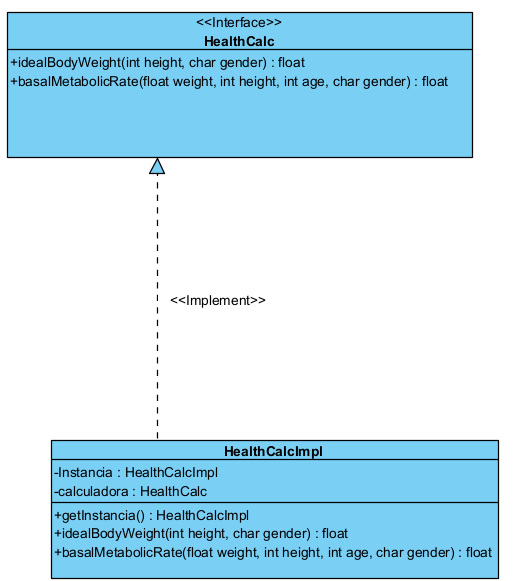
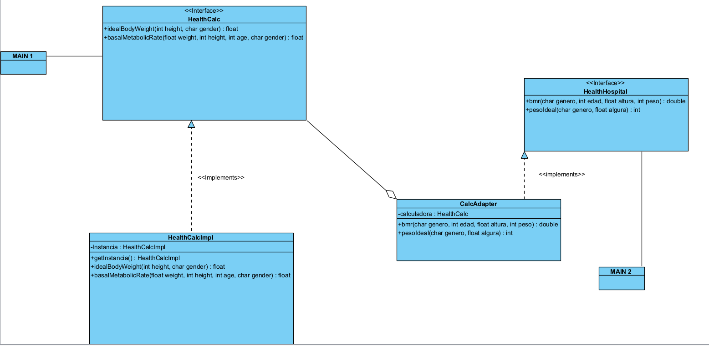
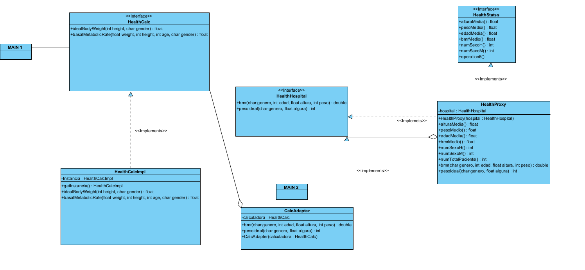
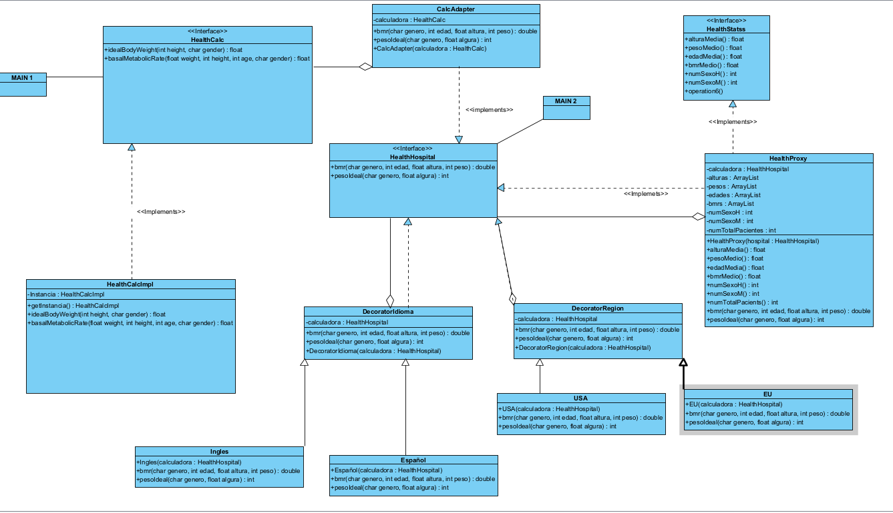

# isa2025-healthcalc
Health calculator used in Ingeniería del Software Avanzada
# Practica 1

## Casos de prueba 

A continuación se enumerará una serie de prueba que se tendrá en cuenta , a la hora de realizar el proyecto.

### Ideal Weight
 -Test en la situación de introducir un género diferente a "m" o "w"

 -Test en la situación de introducir una altura en negativo

 -Test calcular correctamente el idealWeight para hombres

 -Test calcular correctamente el idealWeight para mujeres

 -Test en la situacion de introducir una altura igual a 0

### Basal Metabolic Rate
-Test en la situación de introducir un peso negativo

-Test en la situación de introducir una edad negativo

-Test en la situación de introducir una edad igual a 0

-Test en la situación de introducir un genero diferente a "m" o "w"

-Test en la situación de introducir un peso igual a 0

-Test en la situación de introducir una altura igual a 0

-Test en la situación de introducir una altura negativo

-Test calcular correctamente el Basal Metabolic Rate para hombres

-Test calcular correctamente el Basal Metabolic Rate para mujeres

# Resultados Al ejecutar los test

# Commits Realizados durante la Practica 1

# Practica 4

## Prototipo Calculadora

## Interfaz Calculadora

# Practica 6: Patrones de diseño

Para el primer apartado se ha utilizado el patrón Singular.

### Patrón Singular

Para el segundo apartado se ha utilizado el patrón Adapter.

### Patrón Adapter

Para el tercer apartado se ha utilizado el patrón Proxy.

### Patrón Proxy

Para el último apartado se ha utilizado el patrón Decorator.

### Patrón Decorator

